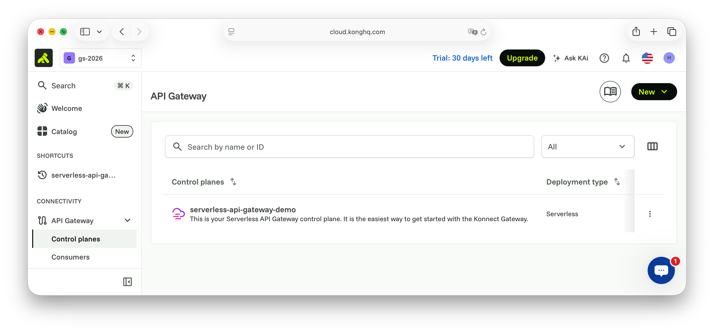
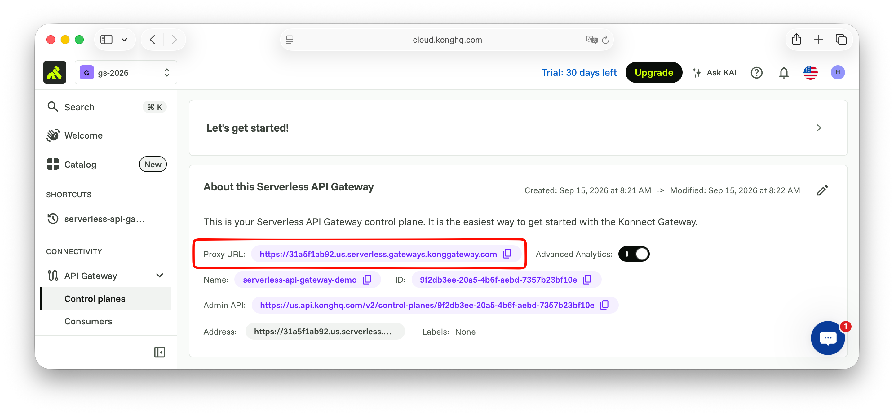
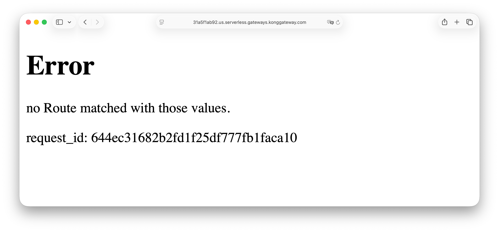

# Scene 0: Orientation

## 목적

Konnect **Serverless** 게이트웨이를 준비하고, AI Gateway 사용을 확인한 뒤 Workshop LLM 환경을 로드합니다. 이후 씬에서 공급자 키 없이 모델을 호출합니다.

엔티티는 **본인** Konnect 조직에 만듭니다. 트래픽은 게이트웨이 Overview의 **Serverless** Proxy URL을 통합니다. LLM 자격 증명은 강사 랩 패킷으로 받습니다.

## 실습

1. [Kong Konnect](https://cloud.konghq.com)에 가입하거나 로그인합니다.
   - 최초 가입 후 1달간 `serverless` 게이트웨이를 사용할 수 있습니다.
2. 회원 가입 후 `Create an Organization`에서 실습자의 조직을 생성합니다.
   - 이름 예시 :  `gs-2026`
   - `Enforce MFA enrollment` 항목은 옵션입니다.
3. 조직 생성 후 몇가지 질문에 답합니다.
   - 회사 규모
   - Konnect 사용 계획 (e.g. workshop)
4. 리전을 확인합니다 — 이 워크샵은 **US**를 사용합니다 (무료 티어 기본 org 경로에서 Serverless 사용)
5. Serverless 게이트웨이를 사용(생성)합니다:
   - 좌측 메뉴 → **CONNECTIVITY** → **API Gateway** → **Control planes**
   - `Deployment Type`이 `serverless`인 항목을 확인합니다.

## Gateway 동작 확인

1. 생성된 `serverless` 게이트웨이를 선택 합니다.
2. `About this Serverless API Gateway`에서 `Proxy URL` 정보를 복사합니다.
3. `Proxy URL`을 다른 웹 브라우저에서 입력하여 화면을 확인합니다.
4. `Error`와 함께 `no Route matched with those values.` 메시지가 출력되면 준비가 끝났습니다.

