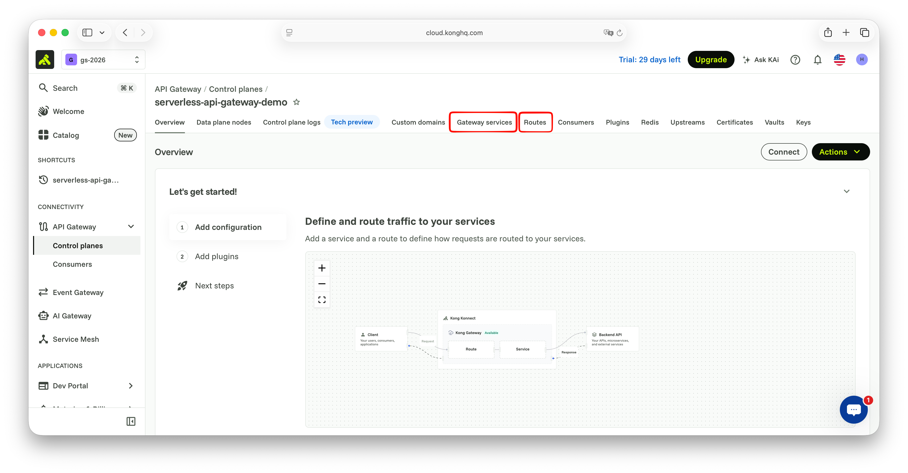
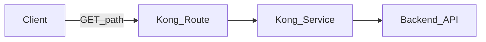
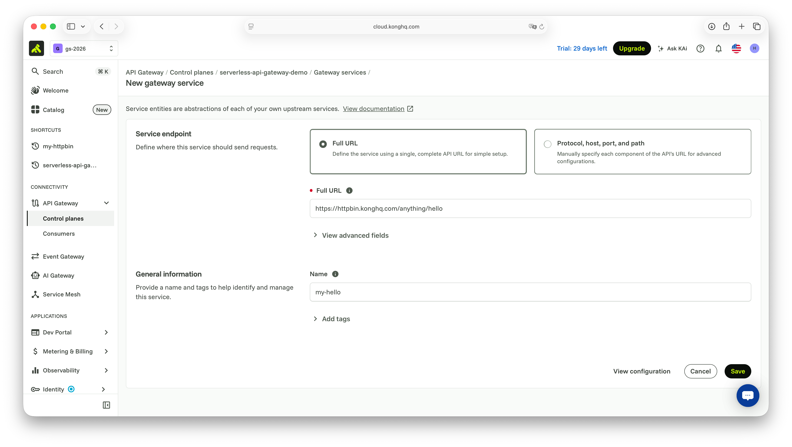
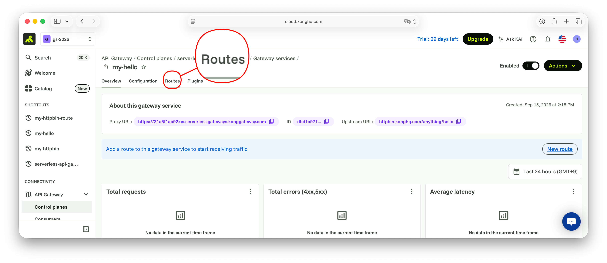
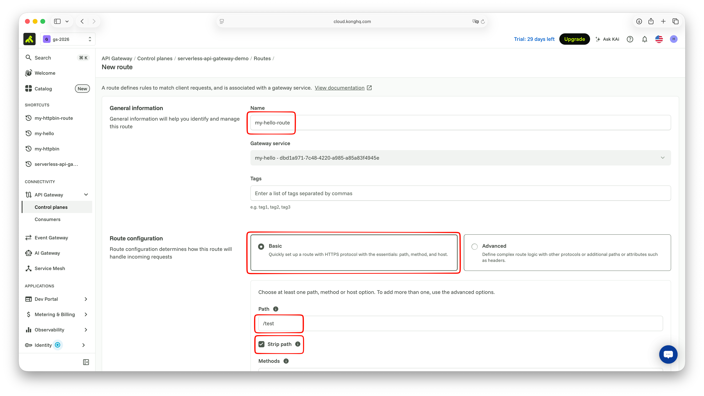
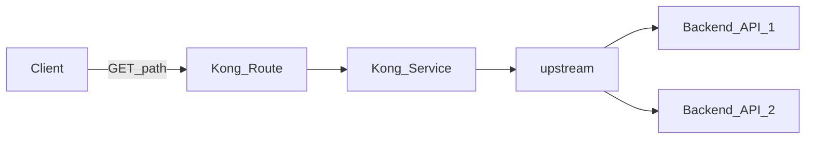
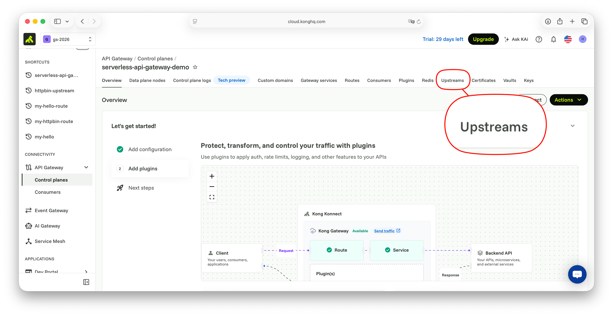
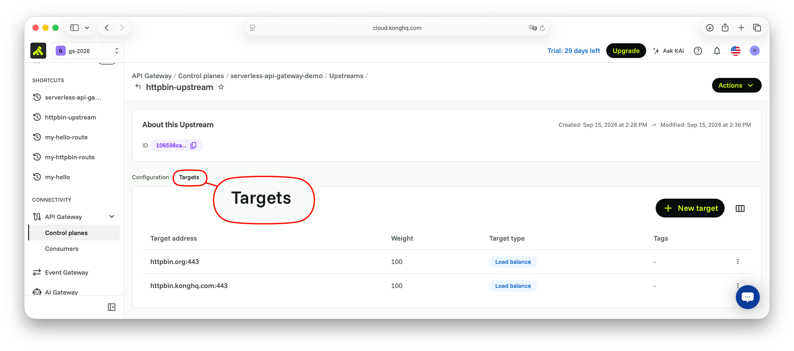

# Scene 1: Services & Routes

## 목적

본인 Konnect Serverless 게이트웨이에서 Kong의 핵심 라우팅 모델인 `Service`(upstream)와 `Route`(클라이언트 진입점)를 학습합니다.

## 실습에서 사용할 메뉴

Konnect 게이트웨이에 Upstream을 가리키는 Service와 클라이언트 트래픽을 받는 Route를 만듭니다.

UI 경로: 좌측 메뉴 → `CONNECTIVITY` → `API Gateway` → `Gateways` → 본인 게이트웨이 → `Gateway services` / `Routes`.



## 아키텍처



</br>
## 실습 1. Service 생성

1. `Gateway services`를 클릭하여 `+ New gateway service` 버튼 클릭

2. Service endpoint

     - `Full URL` 선택

     - `Full URL`에 `https://httpbin.konghq.com/anything/hello` 입력

3. General information

     - Name에 임의의 사용자 정의 이름 입력 (e.g. `my-hello`)

4. `Save` 버튼 클릭



</br>

## 실습 2. Route 생성

Service 등록 후 해당 화변으로 전환 됩니다. Service는 등록되었지만, 아직 해당 Service에 접근할 수 있는 엔드포인트 정의는 없습니다. 해당 메뉴 상단의 `Routes`를 선택합니다.



1. `Routes`를 클릭하여 `+ New route` 버튼 클릭
2. General information
     - Name에 임의의 사용자 정의 이름 입력 (e.g. `my-hello-route`)
3. Route configuration

     - Basic 선택

     - Paths에 `/test` 입력

     - `Strip path`는 활성화

4. `Save` 버튼 클릭



### 구성 확인

Upstream을 직접 호출해봅니다. (개인정보 보호 브라우저에서 하는것을 권장합니다.)
- <https://httpbin.konghq.com/anything/hello>

```json
{
  "args": {}, 
  "data": "", 
  "files": {}, 
  "form": {}, 
  "headers": {
    "Accept": "text/html,application/xhtml+xml,application/xml;q=0.9,*/*;q=0.8", 
    "Accept-Encoding": "gzip, deflate, br, zstd", 
    "Accept-Language": "ko-KR,ko;q=0.9", 
    "Connection": "keep-alive", 
    "Host": "httpbin.konghq.com", 
    "Priority": "u=0, i", 
    "Sec-Fetch-Dest": "document", 
    "Sec-Fetch-Mode": "navigate", 
    "Sec-Fetch-Site": "none", 
    "User-Agent": "Mozilla/5.0 (Macintosh; Intel Mac OS X 10_15_7) AppleWebKit/605.1.15 (KHTML, like Gecko) Version/26.6.2 Safari/605.1.15"
  }, 
  "json": null, 
  "method": "GET", 
  "origin": "<client-ip>", 
  "url": "http://httpbin.konghq.com/anything/hello"
}
```

Kong Gateway를 통해 호출해봅니다. 앞서 우리는 다음을 구성했습니다.
- `httpbin.konghq.com`의 `/anything/hello`를 Service로 등록했습니다.
- 등록한 서비스로의 접근을 위해 Route를 등록했고, 그 Path는 `/test` 입니다.

Proxy URL에 `/test`을 붙여 호출해봅니다.

<https://[MY_PROXY_URL]/test>

```json
{
  "args": {}, 
  "data": "", 
  "files": {}, 
  "form": {}, 
  "headers": {
    "Accept": "text/html,application/xhtml+xml,application/xml;q=0.9,*/*;q=0.8", 
    "Accept-Encoding": "gzip, deflate, br, zstd", 
    "Accept-Language": "ko-KR,ko;q=0.9", 
    "Connection": "keep-alive", 
    "Host": "httpbin.konghq.com", 
    "Priority": "u=0, i", 
    "Sec-Fetch-Dest": "document", 
    "Sec-Fetch-Mode": "navigate", 
    "Sec-Fetch-Site": "none", 
    "User-Agent": "Mozilla/5.0 (Macintosh; Intel Mac OS X 10_15_7) AppleWebKit/605.1.15 (KHTML, like Gecko) Version/26.6.2 Safari/605.1.15", 
    "X-Forwarded-Host": "<proxy-host>", 
    "X-Forwarded-Path": "/test", 
    "X-Forwarded-Prefix": "/test", 
    "X-Kong-Request-Id": "80ba254c4df91a2204f9046eadca956c"
  }, 
  "json": null, 
  "method": "GET", 
  "origin": "<client-ip>", 
  "url": "$KONNECT_PROXY_URL/anything/hello"
}
```

실제 `Host`는 동일합니다. 어떤 `header`가 추가되었는지 확인해보세요.

</br>
## 실습 3. Upstream 추가

<https://httpbin.org> 는 <https://httpbin.konghq.com>의 복제 서비스입니다. API 서비스의 Load balancing을 위해 Service는 Upstream에 여러 Target을 등록할 수 있습니다.




설정 방식: `Upstream`에 Target 2개를 등록한 뒤, 기존 Service의 host를 해당 Upstream 이름으로 바꿉니다.



1. 좌측 메뉴 → `CONNECTIVITY` → `API Gateway` → `Gateways` → 본인 게이트웨이 → `Upstreams`
2. `+ New upstream` 클릭
   - Name 예: `httpbin-upstream`
   - Algorithm: `Round-robin` (기본값 사용 가능)
   - `Save`

등록된 Upstream `httpbin-upstream`은 앞서 구성한 `https://httpbin.konghq.com` 대신 연결지점으로 사용됩니다.

Upstream을 호출할 때의 대상(Target)은 여러개 등록 가능합니다. 여기서는 <https://httpbin.org>, <https://httpbin.konghq.com>를 등록합니다.

1. 생성한 Upstream에서 `Targets` → `+ New target`
   - Target: `httpbin.konghq.com:443`, Weight: `100` → `Save`
2. 같은 Upstream에 Target을 하나 더 추가
   - Target: `httpbin.org:443`, Weight: `100` → `Save`
3. `Gateway services`에서 실습 1에서 만든 Service를 연 뒤 편집
   - Endpoint를 Upstream 연결로 변경 (Host의 기존 `httpbin.konghq.com`를 삭제하고  `httpbin-upstream` 입력)
   - `Save`



Proxy URL로 Route path를 여러 번 호출하며 응답의 `Host` / `url`이 `httpbin.konghq.com`과 `httpbin.org`로 번갈아 가는지 확인합니다.
- 브라우저의 경우 캐시가 발생할 수 있으므로, 캐시 삭제 후 완전 새로고침을 해야 합니다.
- `curl`, `http` CLI를 활용해보세요. 

<https://[MY_PROXY_URL]/test>

```bash
> curl -sS "$KONNECT_PROXY_URL/test" | jq -r '.headers.Host'

httpbin.org
httpbin.konghq.com
```