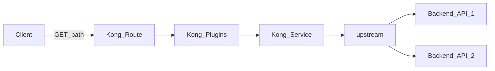

# Scene 2: Plugin

Plugins can be applied to Consumers, Routes, and Services. In this lab you enable plugins on a Route (or Service).




</br>

## Lab 1. Add plugin — Rate Limiting Advanced

1. Open the Route you created → `Plugins` → `+ New Plugin`
2. Select `Rate Limiting Advanced` (you can search from the top search tab)
3. Plugin scope is already set to that Route because you opened the plugin from the Route
4. Under Plugin configuration, set `Request limits`
   - `5` Every `20` Seconds
5. Click `Save`


Call `/test` on the Proxy URL repeatedly.
In a browser, when the limit is exceeded you should see `{"message":"API rate limit exceeded"}`.

With `curl` or an `http` CLI, you can watch the rate-limit headers approach the ceiling.

```
> http https://[MY_PROXY_URL]/test
HTTP/1.1 200 OK
...
X-RateLimit-Limit-20: 5
X-RateLimit-Remaining-20: 1
{
    ...
}

> http https://[MY_PROXY_URL]/test
HTTP/1.1 429 Too Many Requests
...
X-RateLimit-Limit-20: 5
X-RateLimit-Remaining-20: 0

{
    "message": "API rate limit exceeded"
}
```

</br>

## Lab 2. Add plugin — Response Transformer

Add a custom header to the response.

1. Route → `Plugins` → `+ New Plugin`
2. Select `Response Transformer`
3. `Add` header example: `X-Workshop-Demo: scene-2`
4. Click `Save`


Call `/test` with `curl` or an `http` CLI and confirm the header on the response.

```
> http https://[MY_PROXY_URL]/test
HTTP/1.1 200 OK
...
X-Workshop-Demo: scene-2

{
    ...
}
```

</br>

## Lab 3. Add plugin — Request Termination

Return immediately on a path without calling upstream.

1. Route → `Plugins` → `+ New Plugin`
2. Select `Request Termination`
3. Under Plugin configuration, set:
   - `status_code` = `403`
   - `message` = `terminated by workshop`
4. `Save`

Call `/test` on the Proxy URL.
In a browser, confirm `{"message":"terminated by workshop"}`.

With `curl` or an `http` CLI, confirm the status code.

```
> http https://[MY_PROXY_URL]/test
HTTP/1.1 403 Forbidden
...

{
    "message": "terminated by workshop"
}
```

</br>

## Lab 4. Add Route — header-conditioned Route

Kong can register multiple Routes on the same Path with different conditions. Here, configure a Route that matches when a specific Header is present.

1. Select the Gateway service you created earlier (e.g. `my-hello`)
2. Open the Routes tab on that Service and click `+ New route`. An existing Route is already there.
3. Enter a Name under General information. The Gateway service stays selected as the existing Service.
   - Name example: `my-httpbin-header-route`
4. Under Route configuration, set:
   - Select the `Advanced` type
   - Paths: `/test` (same as the previous Route)
   - Headers example: `X-Workshop-Route: special`
5. Click `Save`


A call without the header hits the existing Route, so `Request Termination` still returns 403.

A call that includes `X-Workshop-Route: special` matches the new Route.

```bash
> curl https://[MY_PROXY_URL]/test
{"message":"terminated by workshop"}

> curl -H "X-Workshop-Route: special" https://[MY_PROXY_URL]/test
{
    ...
    "url": "https://[MY_PROXY_URL]/anything/hello"
}
```
