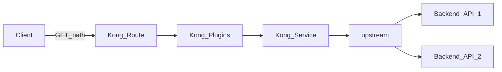
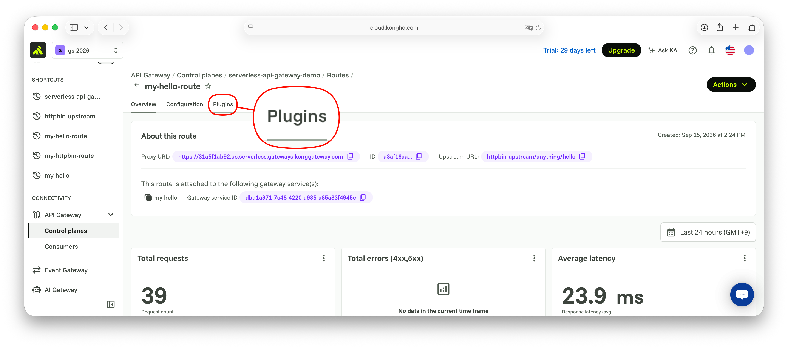
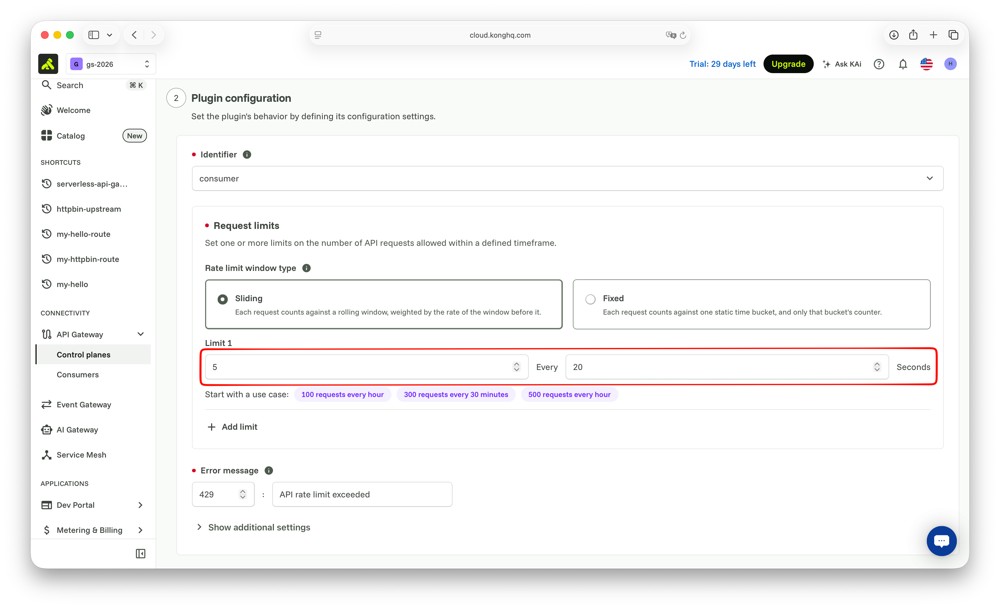
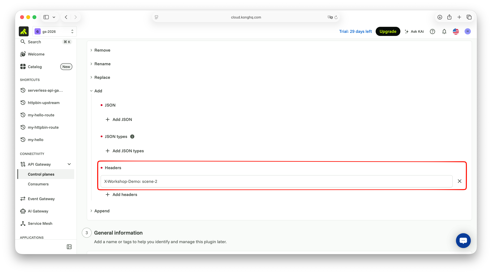
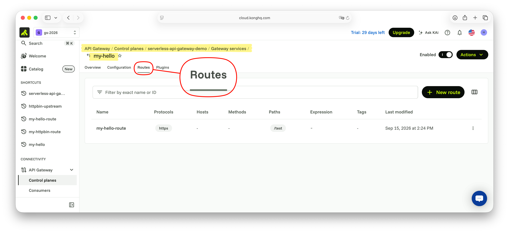

# Scene 2: Plugin

플러그인은 Consumer, Route, Service에 적용할 수 있습니다. 해당 실습에서는 Route(또는 Service)에 플러그인을 활성화 합니다.





</br>

## 실습 1. Plugin 추가 - Rate Limiting Advanced

1. 생성한 Route → `Plugins` → `+ New Plugin`
2. `Rate Limiting Advanced` 선택 (상단 검색 탭에서 검색 가능)
3. Plugin scope는 Route에서 클릭하여 진행해서, 자동으로 해당 Route가 선택되어 있습니다.
4. Plugin configuration에서 `Request limits`를 설정합니다.
    - `5` Every `20` Seconds
4. `Save` 버튼을 클릭합니다.



Proxy URL로 `/test`를 연속 호출합니다
브라우저에서는 한도 초과 시 `{"message":"API rate limit exceeded"}` 응답을 확인합니다.

`curl`, `http` CLI를 사용하여 호출하면, Header에서 Limit가 상한에 도달하는 Header 값을 확인할 수 있습니다.

```
> http "$KONNECT_PROXY_URL/test"
HTTP/1.1 200 OK
...
X-RateLimit-Limit-20: 5
X-RateLimit-Remaining-20: 1
{
    ...
}

> http "$KONNECT_PROXY_URL/test"
HTTP/1.1 429 Too Many Requests
...
X-RateLimit-Limit-20: 5
X-RateLimit-Remaining-20: 0

{
    "message": "API rate limit exceeded"
}
```

</br>

## 실습 2. Plugin 추가 - Response Transformer

응답에 커스텀 헤더를 추가합니다.

1. Route → `Plugins` → `+ New Plugin`
2. `Response Transformer` 선택
3. `Add` 헤더 예: `X-Workshop-Demo: scene-2`
4. `Save` 버튼을 클릭합니다.



`curl`, `http` CLI를 사용하여 호출하면 `/test`을 호출하고 응답 헤더에 값이 있는지 확인합니다

```
> http "$KONNECT_PROXY_URL/test"
HTTP/1.1 200 OK
...
X-Workshop-Demo: scene-2

{
    ...
}
```

</br>

## 실습 3. Plugin 추가 - Request Termination

특정 경로에서 upstream 없이 즉시 응답합니다.

1. Route → `Plugins` → `+ New Plugin`
2. `Request Termination` 선택
3. Plugin configuration에 다음 구성을 진행합니다.
    - `status_code` = `403`
    - `message` = `terminated by workshop`
4. `Save`

Proxy URL로 `/test`를 호출합니다
브라우저에서는 `{"message":"terminated by workshop"}` 응답을 확인합니다.

`curl`, `http` CLI를 사용하여 호출하면 응답 코드를 확인할 수 있습니다.

```
> http "$KONNECT_PROXY_URL/test"
HTTP/1.1 403 Forbidden
...

{
    "message": "terminated by workshop"
}
```

</br>

## 실습 4. Route 추가 - Header 조건이 추가된 Route

Kong에서는 Route를 조건에 따라 동일 Path를 여러개 등록할 수 있습니다. 여기서는 특정 Header가 추가된 경우 해당 Route를 접근하도록 구성합니다.

1. 이전에 생성한 Gateway services를 선택합니다. (e.g. `my-hello`)
2. 해당 Service에서 Routes 탭을 선택하고 `+ New route`를 클릭합니다. 기존에 생성된 Route가 있습니다.
3. General information에 Name을 입력합니다. Gateway service는 기존 Service가 선택되어 있습니다.
    - Name 예: `my-httpbin-header-route`
3. Route configuration에서 다음과 같이 구성합니다.
    - `Advanced` 유형 선택
    - Pahts는 이전 Route와 동일하게 `/test` 입력
    - `Headers`에 예: `X-Workshop-Route: special` 입력
5. `Save` 버튼 클릭



헤더 없이 호출하면 기존 Route를 호출하면서 `Request Termination`이 적용되어있으므로 403 오류가 발생합니다.

`X-Workshop-Route: special` 포함 호출하면 새 Route로 매칭됩니다.

```bash
> curl "$KONNECT_PROXY_URL/test"
{"message":"terminated by workshop"}

> curl -H "X-Workshop-Route: special" "$KONNECT_PROXY_URL/test"
{
    ...
    "url": "$KONNECT_PROXY_URL/anything/hello"
}
```