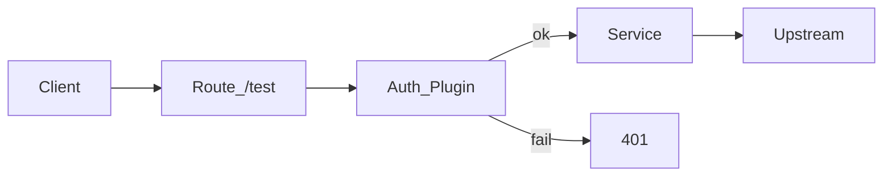
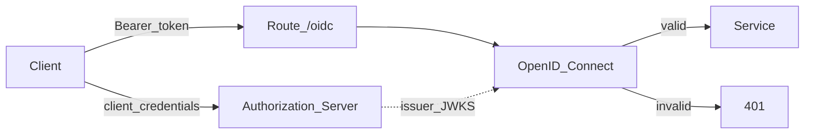

# Scene 3: Auth

## Purpose

Disable the `Request Termination` plugin from Scene 2, then protect the same traffic path with authentication.

1. `Consumer` + `key-auth` for API Key authentication
2. Konnect `Authorization Servers` (Kong Identity) with `OpenID Connect` for Bearer token authentication

Compare two ways clients prove identity without holding upstream secrets.

## Prep. Disable Request Termination

If `Request Termination` from Scene 2 Lab 3 is still enabled on the `/test` Route, every call returns `403` before auth labs can work. Disable it first.

1. Gateway → your Service (e.g. `my-hello`) → Routes → select the `/test` Route
2. Open the `Plugins` tab and select `Request Termination`
3. **Disable** or delete the plugin
4. Call `/test` on the Proxy URL and confirm you no longer get `403` (expect 200 before auth is added)

```bash
curl -sS https://[MY_PROXY_URL]/test
```

You may keep the header-conditioned Route (`X-Workshop-Route: special`). This scene uses `/test` as the primary path.



</br>

## Lab 1. Add a Consumer and key-auth

Map callers to a Consumer with an API Key. Missing or invalid keys return `401`.

### 1-1. Create a Consumer and API Key

1. Left menu → `CONNECTIVITY` → `API Gateway` → `Gateways` → your gateway
2. `Consumers` → `+ New consumer`
   - Username example: `student-01`
   - `Save`
3. Open the Consumer → `Credentials` → `+ New credential` → `Key authentication`
   - Enter a key or use auto-generate
   - Copy the key value somewhere safe (e.g. `$MY_CONSUMER_KEY`)

### 1-2. Add key-auth on the Route

1. `/test` Route → `Plugins` → `+ New Plugin`
2. Select `Key Authentication` (`key-auth`)
3. Plugin configuration
   - Key names example: `apikey` (header name)
4. `Save`

### 1-3. Verify calls

```bash
# Expect 401
curl -sS -o /dev/null -w "%{http_code}\n" https://[MY_PROXY_URL]/test

# Expect 200
curl -sS https://[MY_PROXY_URL]/test \
  -H "apikey: $MY_CONSUMER_KEY"
```

</br>

## Lab 2. Authorization Server + OpenID Connect

Issue tokens from a Konnect **Identity** Authorization Server, then validate Bearer tokens with the Gateway `OpenID Connect` plugin.

To avoid mixing with key-auth, apply OIDC only on a **new Route** `/oidc`. Keep key-auth on `/test`.



### 2-1. Create an Authorization Server

1. Left menu → `Identity` → `Authorization servers`
2. `New authorization server` (or `+`)
   - Name example: `workshop-auth`
   - Audience example: `workshop-httpbin`
   - `Create`
3. Copy the server **Issuer URL** (`$ISSUER_URL`)

### 2-2. Create a Scope and Client

1. On that Authorization Server, open `Scopes` → new scope
   - Name example: `workshop`
   - `Save`
2. `Clients` → new client
   - Name example: `workshop-client`
   - Grant types: `client_credentials`
   - Allow the scope created above
   - `Create`
3. Copy `client_id` and `client_secret` (the secret may be shown only once)

### 2-3. Create Route `/oidc`

1. Existing Service (e.g. `my-hello`) → Routes → `+ New route`
2. Name example: `my-hello-oidc-route`
3. Paths: `/oidc`, enable `Strip path`
4. `Save`

### 2-4. Add the OpenID Connect plugin

Bearer validation needs `issuer`, an `audience` that matches the JWT `aud`, and `auth_methods: bearer`. Client id/secret are for **issuing** tokens; they are not required to validate an already issued Bearer token.

1. `/oidc` Route → `Plugins` → `+ New Plugin`
2. Select `OpenID Connect`
3. Plugin configuration:
   - Common
     - Select `External auth server`
     - Set `issuer` to the Authorization Server Issuer URL
       (e.g. `https://<id>.us.identity.konghq.com/auth`)
     - Leave `Client id` / `Client secret` empty, or fill them if the UI requires them
   - Under `Show additional settings` (or Advanced), set:
     - `auth_methods`: `bearer` only (disable authorization_code and others)
     - `audience`: same as the Authorization Server Audience
       (e.g. `workshop-httpbin`)
   - General information
     - Name example: `oidc_konnect`
4. `Save`

JWT Payload `iss` must match `issuer`, and `aud` must match `audience`. A mismatch returns `401 Unauthorized` / `invalid_token`.

### 2-5. Issue a token and call the route

A call to `/oidc` without credentials returns 401.

Kong Identity access tokens are short-lived (`expires_in` ≈ 300s). Re-issue after inspecting the JWT on jwt.io if needed.

```bash
export ISSUER_URL=<authorization-server-issuer>
export CLIENT_ID=<client-id>
export CLIENT_SECRET=<client-secret>

export ACCESS_TOKEN=$(curl -sS -X POST "$ISSUER_URL/oauth/token" \
  -H "Content-Type: application/x-www-form-urlencoded" \
  -d "grant_type=client_credentials" \
  -d "client_id=$CLIENT_ID" \
  -d "client_secret=$CLIENT_SECRET" \
  -d "scope=workshop" | jq -r '.access_token')

# No token → expect 401
curl -sS -o /dev/null -w "%{http_code}\n" https://[MY_PROXY_URL]/oidc

# Bearer token → expect 200
curl -sS https://[MY_PROXY_URL]/oidc \
  -H "Authorization: Bearer $ACCESS_TOKEN"
```

On jwt.io, confirm `iss` ≈ plugin `issuer`, `aud` ≈ `workshop-httpbin`, and `exp` is still in the future.

</br>

## Summary

| Path | Auth | Client credential |
|---|---|---|
| `/test` | `key-auth` | Header `apikey` |
| `/oidc` | `openid-connect` | `Authorization: Bearer <token>` |

The Authorization Server issues the token; the Gateway validates it via the Issuer. Do not paste Consumer keys or OAuth client secrets into docs or chat.
