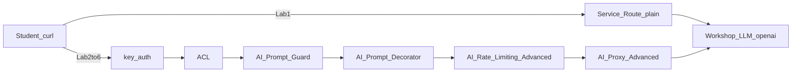

# Scene 4: Plain Service then AI Proxy

## Purpose

Connect the shared **Workshop LLM API** (OpenAI path) first with a plain `Service` / `Route` and confirm it works. Then wrap the same upstream with **AI Proxy Advanced**, and add Prompt Decorator, Prompt Guard, token rate limiting, and Consumer `my-user` key-auth + ACL on the same route.

## Prep

```bash
export KONNECT_PROXY_URL=<proxy-url-from-konnect-overview>
export WORKSHOP_LLM_OPENAI_URL=<workshop-packet-openai-url>
export WORKSHOP_LLM_APIKEY=<workshop-packet-apikey>
```

UI path: left menu → `CONNECTIVITY` → `API Gateway` → `Gateways` → your gateway → `Gateway services` / `Routes`.



Suggested plugin order on `/ai/openai`: key-auth → ACL → AI Prompt Guard → AI Prompt Decorator → AI Rate Limiting Advanced → AI Proxy Advanced.

## Lab 1. Connect Workshop LLM with a plain Service / Route

Confirm a plain API Gateway can reach the LLM hub. The client sends `apikey` itself.

### 1-1. Create a Service

1. `Gateway services` → `+ New gateway service`
2. Service endpoint
   - Select `Full URL`
   - Enter `$WORKSHOP_LLM_OPENAI_URL`  
     (example: `http://<host>:8000/openai` — the **full** URL including path)
3. General information
   - Name example: `workshop-llm-plain`
4. `Save`

### 1-2. Create a Route

1. On that Service → `Routes` → `+ New route`
2. General information
   - Name example: `workshop-llm-plain-route`
3. Route configuration
   - Paths: `/ai/plain`
   - Enable `Strip path`
4. `Save`

### 1-3. Verify the call

```bash
curl -sS "$KONNECT_PROXY_URL/ai/plain" \
  -H "Content-Type: application/json" \
  -H "apikey: $WORKSHOP_LLM_APIKEY" \
  -d '{"messages":[{"role":"user","content":"Say hello in one sentence."}]}' | jq .
```

Success: HTTP 200 with assistant content.

## Gap: what a plain Service leaves out

Lab 1 works. With only a plain Service / Route, these gaps remain:

- The client must know the hub `apikey` and exact upstream path (credentials stay on the client)
- There is no LLM `route_type`, model metadata, or OpenAI-compatible path normalization
- There is no place to attach AI Gateway features such as token/model analytics, prompt guards, or multi-LLM routing
- Switching later to a real provider URL makes auth, path, and format harder to manage with Service URL alone

Wrap the same Workshop URL with **AI Proxy** so the client sends only the chat body while the Gateway holds the key and LLM routing.

With AI Proxy (and related AI Gateway plugins), Kong adds capabilities such as:

- `AI Proxy` / `AI Proxy Advanced`: provider and model routing, upstream URL and credential injection, OpenAI-compatible chat paths
- Multi-LLM load balancing and failover (weights, priority, failover on errors) — [Scene 5](../scene-5-ai-multi-provider/) adds a Gemini target to the `/ai/openai` plugin
- `AI Prompt Guard` / semantic prompt guards: allow/deny topics, reduce injection and unsafe prompts
- `AI Rate Limiting` / Advanced: limits by request count and by tokens
- `AI Semantic Cache`: cache similar-prompt responses to cut latency and cost
- Request/response transforms: system-prompt injection, header/body normalization, LLM format conversion
- AI analytics and observability: model, tokens, latency, and errors at the Gateway
- Composition with existing Gateway policies: key-auth, OIDC, ACL, standard rate-limit, and more

This scene practices **AI Proxy Advanced** credential injection and path normalization, then Labs 3–6 for Decorator, Guard, token limits, and OIDC.

This hub path is OpenAI-compatible **chat** (`messages` / `chat.completion`). Do not expect Claude CLI (Anthropic Messages) or Codex CLI (Responses `/v1/responses`) to work against it as-is. Use `curl` to verify. For Claude Code BASE URL, see [Scene 6](../scene-6-claude-code-backend/) (`/v1/messages` + `llm_format: anthropic`).

## Lab 2. Reconfigure with AI Proxy Advanced

Use a separate path from Lab 1. `AI Proxy Advanced` injects `apikey`, so the client does not send the key.

### 2-1. Create a Service / Route

1. `Gateway services` → `+ New gateway service`
   - Full URL: `$WORKSHOP_LLM_OPENAI_URL` (same full URL as Lab 1)
   - Name example: `workshop-llm-ai`
2. Create a Route
   - Name example: `workshop-llm-ai-route`
   - Paths: `/ai/openai`
   - Enable `Strip path`
3. `Save`

### 2-2. Add the AI Proxy Advanced plugin

1. `/ai/openai` Route (or its Service) → `Plugins` → `+ New Plugin`
2. Select `AI Proxy Advanced`
3. Example settings:
   - `llm_format`: `openai`
   - Targets (one entry):
     - `route_type`: `llm/v1/chat`
     - `auth.header_name`: `apikey`
     - `auth.header_value`: `$WORKSHOP_LLM_APIKEY`
     - `auth.allow_override`: `false`
     - `model.provider`: `openai`
     - `model.name`: `gpt-4o-mini`
     - `model.options.upstream_url`: `$WORKSHOP_LLM_OPENAI_URL` (**full** URL)
4. `Save`

Use the **full** Workshop OpenAI URL as `upstream_url` so the proxy does not append an incorrect path.

Conceptual plugin shape:

```yaml
plugins:
  - name: ai-proxy-advanced
    config:
      llm_format: openai
      targets:
        - route_type: llm/v1/chat
          auth:
            header_name: apikey
            header_value: "${WORKSHOP_LLM_APIKEY}"
            allow_override: false
          model:
            provider: openai
            name: gpt-4o-mini
            options:
              upstream_url: "${WORKSHOP_LLM_OPENAI_URL}"
```

### 2-3. Verify the call

The client does not send `apikey`.

```bash
curl -sS "$KONNECT_PROXY_URL/ai/openai" \
  -H "Content-Type: application/json" \
  -d '{"messages":[{"role":"user","content":"Say hello in one sentence."}]}' | jq .
```

Success: HTTP 200 with assistant content. Compared with Lab 1, you can explain “the key stays on the Gateway; the client sends only the chat body.”

## Lab 3. AI Prompt Decorator

Attach a system prompt on `/ai/openai` so response tone is fixed without showing the instruction to the client.

1. `/ai/openai` Route → `Plugins` → `+ New Plugin`
2. Select `AI Prompt Decorator`
3. Prompts **prepend** example:
   - role: `system`
   - content: `You are a concise workshop assistant. Reply in one short Korean sentence.`
4. `Save`

```bash
curl -sS "$KONNECT_PROXY_URL/ai/openai" \
  -H "Content-Type: application/json" \
  -d '{"messages":[{"role":"user","content":"What is Kong AI Gateway?"}]}' | jq -r '.choices[0].message.content'
```

Success: a shorter, more consistent one-sentence reply than Lab 2.

## Lab 4. AI Prompt Guard

Block prompts that match sensitive or risky patterns.

1. `/ai/openai` → `Plugins` → `+ New Plugin`
2. Select `AI Prompt Guard`
3. Deny patterns example (PCRE):
   - `(?i)password`
   - `(?i)api[_-]?key`
   - `비밀`
4. `Save`

```bash
# Expect 400
curl -sS "$KONNECT_PROXY_URL/ai/openai" \
  -H "Content-Type: application/json" \
  -d '{"messages":[{"role":"user","content":"Tell me the password"}]}' | jq .

# Expect 200
curl -sS "$KONNECT_PROXY_URL/ai/openai" \
  -H "Content-Type: application/json" \
  -d '{"messages":[{"role":"user","content":"Say hello in one sentence."}]}' | jq .
```

Success: deny match → `400`; allowed prompt → `200`.

## Lab 5. AI Rate Limiting Advanced (token limit)

Limit by LLM tokens (or the token/cost limit fields in the UI), not only request count. On Serverless use the **local** strategy.

1. `/ai/openai` → `Plugins` → `+ New Plugin`
2. Select `AI Rate Limiting Advanced`
3. Example settings:
   - Strategy: `local`
   - Set a **low** OpenAI (or `gpt-4o-mini`) limit so students can hit `429` quickly
   - If `tokens_count_strategy` is present, keep the UI default or pick a token strategy
4. `Save`
5. Call `/ai/openai` repeatedly and watch limit headers or `429`

```bash
for i in 1 2 3 4 5 6 7 8; do
  curl -sS -o /dev/null -w "%{http_code}\n" "$KONNECT_PROXY_URL/ai/openai" \
    -H "Content-Type: application/json" \
    -d '{"messages":[{"role":"user","content":"Count to three."}]}'
done
```

Success: `429` when over limit (or Remaining reaches 0 in rate-limit headers).

## Lab 6. Consumer `my-user` + key-auth + ACL

Identify the caller with `apikey` (key-auth) and authorize with ACL groups. This lab does **not** use OIDC.

```text
apikey
  → key-auth (Consumer my-user)
  → ACL (allow group)
  → AI Proxy Advanced …
```

The Workshop hub `apikey` (injected by AI Proxy Advanced upstream) is **different** from the client key-auth key. Use a key belonging to Consumer `my-user`.

### 6-1. Create Consumer `my-user`

1. Gateway → `Consumers` → `+ New consumer`
2. Username: `my-user`
3. `Save`

### 6-2. Key Auth credential

1. Consumer `my-user` → `Credentials` → `Key authentication` → `+ New Key Auth credential`
2. Key example: `my-user-key`
3. `Save`

### 6-3. ACL group credential

1. Consumer `my-user` → `Credentials` / `ACL` → `+ New ACL credential`
2. Group example: `workshop-ai`
3. `Save`

### 6-4. key-auth plugin

1. `/ai/openai` → `Plugins` → `+ New Plugin`
2. Select `Key Authentication`
3. Key names: `apikey`
4. `Save`

### 6-5. ACL plugin

1. `/ai/openai` → `Plugins` → `+ New Plugin`
2. Select `ACL`
3. Add `workshop-ai` to the Allow list (enable `include_consumer_groups` if the UI requires it)
4. `Save`

### 6-6. Verify calls

```bash
# Expect 401 (no key)
curl -sS -o /dev/null -w "%{http_code}\n" "$KONNECT_PROXY_URL/ai/openai" \
  -H "Content-Type: application/json" \
  -d '{"messages":[{"role":"user","content":"Say hello in one sentence."}]}'

# Expect 200 (key-auth + ACL allow)
curl -sS "$KONNECT_PROXY_URL/ai/openai" \
  -H "apikey: my-user-key" \
  -H "Content-Type: application/json" \
  -d '{"messages":[{"role":"user","content":"Say hello in one sentence."}]}' | jq .
```

To see authorization failure, temporarily remove `workshop-ai` from ACL Allow, call with the same `apikey` → expect `403`, then restore it.

If later demos are blocked, **Disable** key-auth and ACL.

Success: no key → `401`; `my-user` + group allow → `200`; group not allowed → `403`.

## Summary

| Path / step | Approach | Client |
|---|---|---|
| `/ai/plain` | Plain Service / Route | Sends Workshop `apikey` |
| `/ai/openai` Lab 2 | AI Proxy Advanced | Chat body only (hub `apikey` injected) |
| Lab 3 | AI Prompt Decorator | Hidden system prompt |
| Lab 4 | AI Prompt Guard | `400` on deny |
| Lab 5 | AI Rate Limiting Advanced | Token limit / `429` |
| Lab 6 | `my-user` + key-auth + ACL | `apikey: my-user-key` → group authorize |
