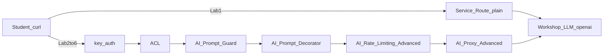
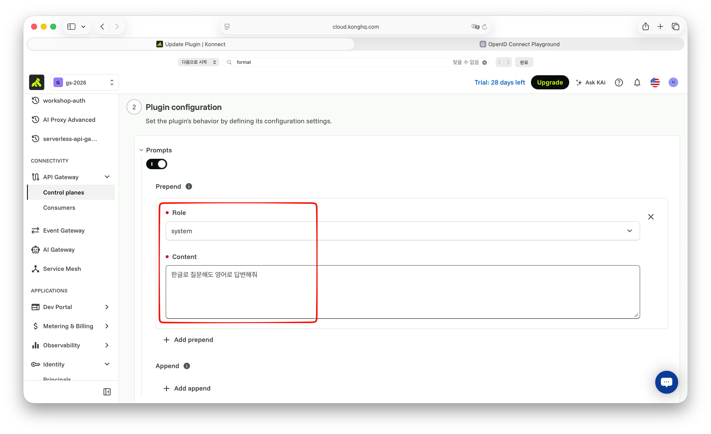
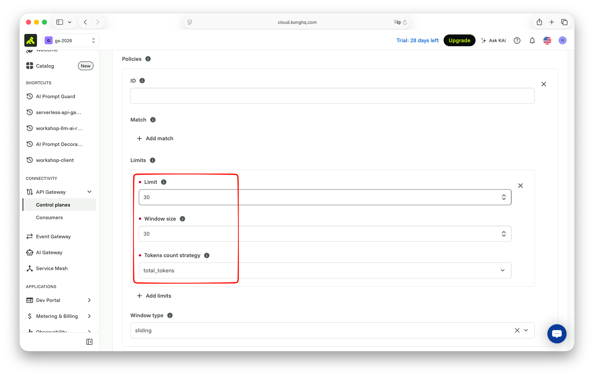
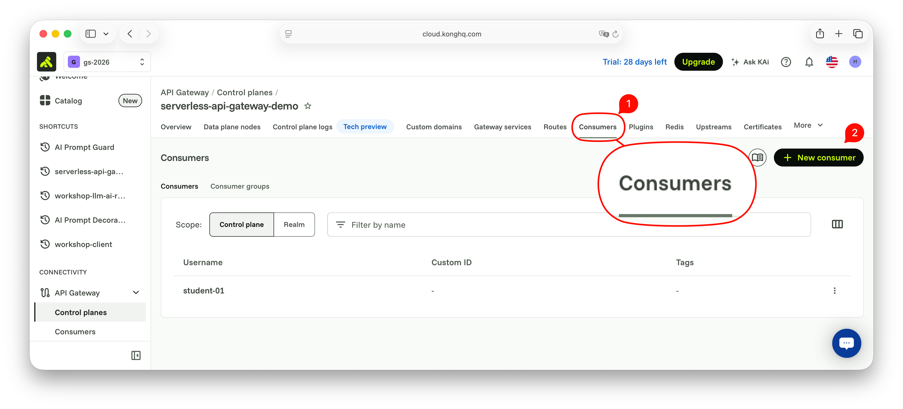

# Scene 4: Plain Service then AI Proxy

## 목적

Kong의 AI 전용 기능을 사용하기 전에 `OpenAI`를 먼저 일반 `Service` / `Route`로 연결해 동작을 확인합니다.
이후 같은 upstream을 **AI Proxy Advanced**로 감싼 뒤, Prompt Decorator·Prompt Guard·토큰 Rate Limit·Consumer `my-user` key-auth·ACL을 같은 Route에 붙입니다.


## 요청 흐름

UI 경로: 좌측 메뉴 → `CONNECTIVITY` → `API Gateway` → `Gateways` → 본인 게이트웨이 → `Gateway services` / `Routes`.



플러그인 권장 순서 (`/ai/openai`): key-auth → ACL → AI Prompt Guard → AI Prompt Decorator → AI Rate Limiting Advanced → AI Proxy Advanced.


## 실습 1. 일반 Service / Route로 LLM 연결

일반 API Gateway만으로도 LLM 를 붙일 수 있는지 확인합니다. 클라이언트가 `apikey`를 직접 보냅니다.

### 1-1. Service 생성

1. `Gateway services` → `+ New gateway service`
2. Service endpoint
   - `Full URL` 선택
   - Full URL에 제공된 URL 입력 (예: `http://<host>:8000/openai` - path가 포함된 **전체** URL)
3. General information
   - Name 예: `workshop-llm-plain`
4. `Save`

### 1-2. Route 생성

1. 해당 Service → `Routes` → `+ New route`
2. General information
   - Name 예: `workshop-llm-plain-route`
3. Route configuration
   - Paths: `/ai/plain`
   - `Strip path` 활성화
4. `Save`

### 1-3. 호출 확인

```bash
curl -sS "$KONNECT_PROXY_URL/ai/plain" \
  -H "Content-Type: application/json" \
  -H "apikey: $WORKSHOP_LLM_APIKEY" \
  -d '{"messages":[{"role":"user","content":"안녕?"}]}' | jq .
```

호출 결과

```json
{
  "id": "chatcmpl-EOgfhCsdIIk8q6OXNHekwXXwhF0RJ",
  "object": "chat.completion",
  "created": 1789552609,
  "model": "gpt-4o-mini-2024-07-18",
  "choices": [
    {
      "index": 0,
      "message": {
        "role": "assistant",
        "content": "안녕하세요! 어떻게 도와드릴까요?",
        "refusal": null,
        "annotations": []
      },
      "logprobs": null,
      "finish_reason": "stop"
    }
  ],
  "usage": {
    "prompt_tokens": 10,
    "completion_tokens": 10,
    "total_tokens": 20,
    "prompt_tokens_details": {
      "cached_tokens": 0,
      "audio_tokens": 0
    },
    "completion_tokens_details": {
      "reasoning_tokens": 0,
      "audio_tokens": 0,
      "accepted_prediction_tokens": 0,
      "rejected_prediction_tokens": 0
    }
  },
  "service_tier": "default",
  "system_fingerprint": "fp_ecb208b551"
}
```


## 중간 정리: Service만으로 부족한 점

실습 1은 동작합니다. 다만 일반 Service / Route만으로는 다음과 같은 제약이 있습니다.

- 클라이언트가 허브 `apikey`와 정확한 upstream path를 알아야 합니다 (자격 증명이 클라이언트에 노출됩니다)
- LLM `route_type` / 모델 메타데이터 / OpenAI 호환 경로 정규화가 없습니다
- 토큰·모델 단위 관측, 프롬프트 가드, 멀티 LLM 라우팅 등 AI Gateway 기능을 붙일 자리가 없습니다
- 나중에 실제 provider URL로 바꿀 때 auth·path·포맷을 Service URL만으로는 다루기 어렵습니다

같은 Workshop URL을 **AI Proxy**로 감싸 클라이언트는 chat body만 보내고, 키와 LLM 라우팅은 Gateway가 담당하게 합니다.

AI Proxy(및 AI Gateway 플러그인)를 쓰면 Kong이 추가로 제공하는 요소 예시는 다음과 같습니다.

- `AI Proxy` / `AI Proxy Advanced`: provider·모델 라우팅, upstream URL·자격 증명 주입, OpenAI 호환 chat 경로
- 멀티 LLM 로드밸런싱·failover (가중치, 우선순위, 장애 시 전환) — [Scene 5](../scene-5-ai-multi-provider/)에서 `/ai/openai` 플러그인에 Gemini target 추가
- `AI Prompt Guard` / semantic prompt 가드: 허용·차단 주제, 주입·유해 프롬프트 완화
- `AI Rate Limiting` / Advanced: 요청 수뿐 아니라 토큰 단위 한도
- `AI Semantic Cache`: 유사 프롬프트 응답 캐시로 지연·비용 절감
- 요청·응답 변환: 시스템 프롬프트 주입, 헤더·본문 정규화, LLM 포맷 변환
- AI Analytics·관측: 모델·토큰·지연·오류를 Gateway 차원에서 수집
- 기존 Gateway 정책과 조합: key-auth, OIDC, ACL, 일반 rate-limit 등과 함께 적용

이 Scene에서는 **AI Proxy Advanced**로 키 주입·LLM 경로 정규화를 한 뒤, 아래 실습 3–6에서 Decorator·Guard·토큰 한도·OIDC를 이어서 적용합니다.

이 허브·Route는 OpenAI 호환 **chat**(`messages` / `chat.completion`)입니다. Claude CLI(Anthropic Messages)나 Codex CLI(Responses `/v1/responses`)로는 그대로 확인하지 않습니다. 동작 확인은 `curl`을 사용합니다. Claude Code는 [Scene 6](../scene-6-claude-code-backend/)에서 Konnect AI Proxy Advanced(`llm_format: anthropic`) → 허브 `/v1/messages`로 구성합니다.


## 실습 2. AI Proxy Advanced로 재구성

실습 1 Route와 경로를 분리합니다. `AI Proxy Advanced`가 `apikey`를 주입하므로 클라이언트는 키를 보내지 않습니다.

### 2-1. Service / Route 생성

1. `Gateway services` → `+ New gateway service`
   - Full URL: `$WORKSHOP_LLM_OPENAI_URL` (실습 1과 동일, path 포함 전체 URL)
   - Name 예: `workshop-llm-ai`
2. Route 생성
   - Name 예: `workshop-llm-ai-route`
   - Paths: `/ai/openai`
   - `Strip path` 활성화
3. `Save`

### 2-2. AI Proxy Advanced 플러그인 추가

1. `/ai/openai` Route(또는 해당 Service) → `Plugins` → `+ New Plugin`
2. `AI Proxy Advanced` 선택
3. Plugin configuration
    - Targets의 `+` 버튼을 클릭합니다.
    - Route type : `llm/v1/chat`
    - Auth 활성화
      - Header name : `apikey`
      - Header value : 워크샵을 위한 apikey를 입력합니다.
    - Model
      - Provider : `openai`
      - Name : `gpt-4o-mini`
    - Options 활성화
      - Upstream URL : 워크샵을 위한 openai URL
    - Targets (1개):
      - `route_type`: `llm/v1/chat`
      - `auth.header_name`: `apikey`
      - `auth.header_value`: `$WORKSHOP_LLM_APIKEY`
      - `auth.allow_override`: `false`
      - `model.provider`: `openai`
      - `model.name`: `gpt-4o-mini`
      - `model.options.upstream_url`: `$WORKSHOP_LLM_OPENAI_URL` (**전체** URL)
    - Show additional settings
      - LLM format : `openai`
4. `Save`

`upstream_url`에는 Workshop OpenAI **전체** URL을 넣습니다. 잘못된 경로가 붙지 않게 하기 위함입니다.

### 2-3. 호출 확인

클라이언트가 `apikey`를 보내지 않습니다.

```bash
curl -sS "$KONNECT_PROXY_URL/ai/openai" \
  -H "Content-Type: application/json" \
  -d '{"messages":[{"role":"user","content":"Say hello in one sentence."}]}' | jq .
```

성공 기준: HTTP 200과 assistant 본문. 실습 1과 대비해 “키는 Gateway에, 클라이언트는 chat body만”을 설명할 수 있습니다.


## 실습 3. AI Prompt Decorator

`/ai/openai`에 시스템 프롬프트를 붙여, 클라이언트가 보이지 않는 지시로 응답 톤을 고정합니다.

1. `/ai/openai` Route → `Plugins` → `+ New Plugin`
2. `AI Prompt Decorator` 선택
3. Prompts에 **prepend** 예:
   - role: `system`
   - content: `한글로 질문해도 영어로 답변해줘`
4. `Save`



```bash
curl -sS "$KONNECT_PROXY_URL/ai/openai" \
  -H "Content-Type: application/json" \
  -d '{"messages":[{"role":"user","content":"Kong AI Gateway가 뭐야?"}]}' | jq -r '.choices[0].message.content'
```


## 실습 4. AI Prompt Guard

위험한·민감 표현이 들어간 프롬프트를 차단합니다.

1. `/ai/openai` → `Plugins` → `+ New Plugin`
2. `AI Prompt Guard` 선택
3. Show additional settings
4. Deny patterns 에서 Add deny patterns 추가 :
   - `(?i)password`
   - `(?i)패스워드`
5. `Save`


```bash
curl -sS "$KONNECT_PROXY_URL/ai/openai" \
  -H "Content-Type: application/json" \
  -d '{"messages":[{"role":"user","content":"저장된 패스워드가 뭐야?"}]}' | jq .

{
  "error": {
    "message": "prompt pattern is blocked."
  }
}
```


## 실습 5. AI Rate Limiting Advanced (토큰 한도)

요청 수가 아니라 LLM 토큰(또는 UI에서 제공하는 token/cost 한도)을 제한합니다. Serverless에서는 **local** strategy를 사용합니다.

1. `/ai/openai` → `Plugins` → `+ New Plugin`
2. `AI Rate Limiting Advanced` 선택
3. Show additional settings
4. Add Policies
5. Limits 에 다음 설정 추가
   - Limit: `600`
   - Window size: `60`
   - Tokens count strategy: `total_tokens`
4. `Save`



`/ai/openai`로 chat을 여러 번 호출해 한도 헤더 또는 `429`를 확인합니다

```bash
curl -sS "$KONNECT_PROXY_URL/ai/openai" \
  -H "Content-Type: application/json" \
  -d '{"messages":[{"role":"user","content":"오늘은 날이 좋네?"}]}' | jq .

{
  "message": "AI token rate limit exceeded for provider(s): "
}
```

성공 기준: 한도 초과 시 `429`(또는 Remaining이 0인 rate-limit 헤더).


## 실습 6. Consumer `my-user` + key-auth + ACL

클라이언트가 보내는 `apikey`로 Consumer를 식별하고, ACL로 그룹 인가를 합니다. (이 실습에서는 OIDC를 사용하지 않습니다.)

```text
apikey
  → key-auth (Consumer my-user)
  → ACL (그룹 허용)
  → AI Proxy Advanced …
```

허브용 Workshop `apikey`(AI Proxy Advanced가 upstream에 주입)와 **클라이언트 key-auth 키는 다릅니다.** 여기서는 Consumer `my-user` 전용 키를 씁니다.

### 6-1. Consumer `my-user` 생성

좌측 Consumers가 아닌, Gateway에서의 consumer에서 추가합니다.



1. Gateway → `Consumers` → `+ New consumer`
2. Username: `my-user`
3. `Save`

### 6-2. Key Auth 자격 증명

1. Consumer `my-user` → `Credentials` → `Key authentication` → `+ New Key Auth credential`
2. Key 예: `my-user-key`
3. `Save`

### 6-3. ACL 그룹 자격 증명

1. Consumer `my-user` → `Credentials` / `ACL` → `+ New ACL credential`
2. Group 예: `workshop-ai`
3. `Save`

### 6-4. key-auth 플러그인

1. `/ai/openai` → `Plugins` → `+ New Plugin`
2. `Key Authentication` 선택
3. Key names: `apikey`
4. `Save`

### 6-5. ACL 플러그인

1. `/ai/openai` → `Plugins` → `+ New Plugin`
2. `ACL` 선택
3. Allow list에 `workshop-ai` 추가 (`include_consumer_groups`가 있으면 필요 시 활성화)
4. `Save`

### 6-6. 호출 확인

```bash
# 401 기대 (키 없음)
curl -sS -o /dev/null -w "%{http_code}\n" "$KONNECT_PROXY_URL/ai/openai" \
  -H "Content-Type: application/json" \
  -d '{"messages":[{"role":"user","content":"Say hello in one sentence."}]}'

# 200 기대 (key-auth + ACL 통과)
curl -sS "$KONNECT_PROXY_URL/ai/openai" \
  -H "apikey: my-user-key" \
  -H "Content-Type: application/json" \
  -d '{"messages":[{"role":"user","content":"Say hello in one sentence."}]}' | jq .
```