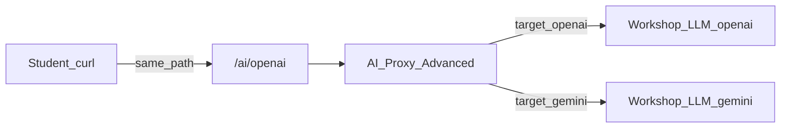

# Scene 5: Gemini round-robin / failover

## Purpose

Add a Gemini target to the **AI Proxy Advanced** plugin you created on `/ai/openai` in Scene 4, then use the same plugin **balancer** for round-robin and failover. Do not create a new Service or Route. Keep the same OpenAI-compatible chat JSON on the client.

## Prerequisites

- Scene 4 Lab 2 done: Route `/ai/openai` + AI Proxy Advanced (one OpenAI target)
- If you completed Scene 4 Lab 6, also send the Consumer `apikey` on calls

## Request flow

UI: `/ai/openai` Route → `Plugins` → edit the existing `AI Proxy Advanced`.



## Lab 1. Add Gemini target + round-robin

Keep the OpenAI target, add one Gemini target, and set `round-robin`. Different hub `/openai` and `/gemini` response `model` values show which target handled the request.

### 1-1. Edit the plugin

1. `/ai/openai` → `Plugins` → `AI Proxy Advanced` → Edit
2. Targets → `+` to add a **second** target
   - Route type: `llm/v1/chat`
   - Auth: Header name `apikey`, Header value `$WORKSHOP_LLM_APIKEY`, `allow_override` false
   - Model: Provider `openai`, Name `gemini-2.5-flash-lite`
   - Options → Upstream URL: `$WORKSHOP_LLM_GEMINI_URL` (**full** URL)
3. Leave the existing OpenAI target as-is (`upstream_url`: `$WORKSHOP_LLM_OPENAI_URL`)
4. Show additional settings → Balancer
   - Algorithm: `round-robin`
   - Equal weights if the UI shows weight
5. Keep LLM format: `openai`
6. `Save`

The Workshop Gemini path is OpenAI-compatible chat, so keep Provider `openai` and point `upstream_url` at the Gemini URL.

```yaml
plugins:
  - name: ai-proxy-advanced
    config:
      llm_format: openai
      balancer:
        algorithm: round-robin
      targets:
        - route_type: llm/v1/chat
          weight: 50
          auth:
            header_name: apikey
            header_value: "${WORKSHOP_LLM_APIKEY}"
            allow_override: false
          model:
            provider: openai
            name: gpt-4o-mini
            options:
              upstream_url: "${WORKSHOP_LLM_OPENAI_URL}"
        - route_type: llm/v1/chat
          weight: 50
          auth:
            header_name: apikey
            header_value: "${WORKSHOP_LLM_APIKEY}"
            allow_override: false
          model:
            provider: openai
            name: gemini-2.5-flash-lite
            options:
              upstream_url: "${WORKSHOP_LLM_GEMINI_URL}"
```

### 1-2. Call

```bash
for i in 1 2 3 4 5 6; do
  curl -sS "$KONNECT_PROXY_URL/ai/openai" \
    -H "Content-Type: application/json" \
    -d '{"messages":[{"role":"user","content":"ping '"$i"'"}]}' \
    | jq -c '{model:.model, ok:(.choices[0].message.content!=null)}'
done
```

Success: all HTTP 200. Mixed OpenAI-family and Gemini-family `model` values show round-robin at work.

## Lab 2. Failover (OpenAI → Gemini)

Temporarily break the OpenAI (primary) upstream so traffic fails over to Gemini.

### 2-1. Balancer and OpenAI upstream

1. Edit the same `AI Proxy Advanced`
2. Balancer
   - Algorithm: `priority` (OpenAI target first / higher priority)
   - Failover criteria: `http_502`, `http_504`, `non_idempotent` (for chat POST)
3. Set the OpenAI target Upstream URL to `http://127.0.0.1:9/openai` temporarily
4. Keep the Gemini target on `$WORKSHOP_LLM_GEMINI_URL`
5. `Save`

Client 4xx alone does not trigger failover. Include upstream failure criteria and `non_idempotent` so POST chat can move to Gemini.

```yaml
plugins:
  - name: ai-proxy-advanced
    config:
      llm_format: openai
      balancer:
        algorithm: priority
        failover_criteria:
          - http_502
          - http_504
          - non_idempotent
      targets:
        - route_type: llm/v1/chat
          auth:
            header_name: apikey
            header_value: "${WORKSHOP_LLM_APIKEY}"
            allow_override: false
          model:
            provider: openai
            name: gpt-4o-mini
            options:
              upstream_url: "http://127.0.0.1:9/openai"
        - route_type: llm/v1/chat
          auth:
            header_name: apikey
            header_value: "${WORKSHOP_LLM_APIKEY}"
            allow_override: false
          model:
            provider: openai
            name: gemini-2.5-flash-lite
            options:
              upstream_url: "${WORKSHOP_LLM_GEMINI_URL}"
```

### 2-2. Call

```bash
curl -sS "$KONNECT_PROXY_URL/ai/openai" \
  -H "Content-Type: application/json" \
  -d '{"messages":[{"role":"user","content":"failover test"}]}' | jq '{model:.model, content:.choices[0].message.content}'
```

Success: HTTP 200 with a Gemini-family `model`.

### 2-3. Restore OpenAI

Set the OpenAI target Upstream URL back to `$WORKSHOP_LLM_OPENAI_URL` and `Save`.

## Lab 3. `429` failover (optional)

To fail over when the hub returns `429` on the primary, add `http_429` to failover criteria.

1. Same plugin → Balancer → add `http_429` to Failover criteria
2. Keep Algorithm `priority` and both upstreams on healthy URLs
3. `Save`
4. (Optional) Burst requests until OpenAI hits the limit, then confirm later calls still return 200 with a Gemini `model`

```yaml
balancer:
  algorithm: priority
  failover_criteria:
    - http_429
    - http_502
    - http_504
    - non_idempotent
```

Success: you can explain HTTP 200 on the same path and body after a primary `429`.

## Success criteria (scene)

- The Scene 4 `/ai/openai` plugin includes a Gemini target
- Round-robin calls show mixed OpenAI/Gemini `model` values (or all 200)
- Breaking OpenAI primary fails over to Gemini with HTTP 200
- (Optional) You can explain `http_429` failover

## Time

About 30 minutes
