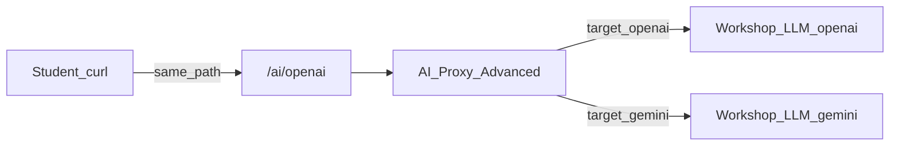
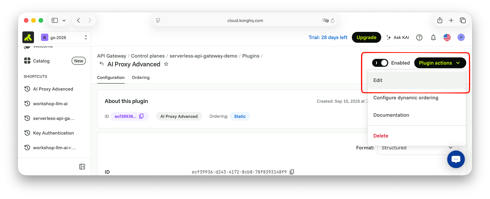

# Scene 5: Gemini round-robin / failover

## 목적

Scene 4에서 `/ai/openai`에 만든 **AI Proxy Advanced**에 Gemini target을 추가하고, 같은 플러그인의 **balancer**로 round-robin과 failover를 확인합니다. 새 Service/Route는 만들지 않습니다. 클라이언트 chat JSON 형태는 그대로입니다.

## 사전 조건

- Scene 4 실습 2 완료: Route `/ai/openai` + AI Proxy Advanced (OpenAI target 1개)
- Scene 4 실습 6까지 했다면 호출 시 Consumer `apikey`도 함께 보냅니다

## 요청 흐름

UI: `/ai/openai` Route → `Plugins` → 기존 `AI Proxy Advanced` 편집.



## 실습 1. Gemini target 추가 + round-robin

기존 OpenAI target은 유지한 채 Gemini target을 하나 더 넣고 `round-robin`으로 분산합니다. 허브 `/openai`와 `/gemini`의 응답 `model`이 다르면 어느 target으로 갔는지 구분할 수 있습니다.

### 1-1. 플러그인 편집




1. `/ai/openai` → `Plugins` → `AI Proxy Advanced` → `Plugin actions` 드롭다운 → Edit
2. Plugin configuration
   - Targets에서 `+`로 **두 번째** target 추가
   - Route type : `llm/v1/chat`
   - Auth 활성화
     - Header name : `apikey`
     - Header value : 워크샵을 위한 apikey를 입력합니다.
   - Model
     - Provider : `openai`
     - Name : `gemini-2.5-flash-lite`
   - Options 활성화
     - Upstream URL : 워크샵을 위한 Gemini URL
3. Balancer (Plugin configuration 설정 최상단)
   - Algorithm을 확인 합니다.(기본  `round-robin`)
4. `Save`


### 1-2. 호출 테스트

```bash
> curl -sS "$KONNECT_PROXY_URL/ai/openai" \
  -X POST \
  -H "Content-Type: application/json" \
  -H "apikey: my-user-key" \
  -d '{"messages":[{"role":"user","content":"오늘은 날이 좋네?"}]}' | jq .

{
	...
  "model": "gpt-4o-mini-2024-07-18",
  ...
}

> curl -sS "$KONNECT_PROXY_URL/ai/openai" \
  -X POST \
  -H "Content-Type: application/json" \
  -H "apikey: my-user-key" \
  -d '{"messages":[{"role":"user","content":"오늘은 날이 좋네?"}]}' | jq .

{
	...
  "model": "gemini-2.5-flash-lite",
  ...
}
```


동일한 `/ai/openai` 호출이지만, 두개의 모델로 나뉘어 호출되는 것을 확인할 수 있습니다.


## 실습 2. Failover (OpenAI → Gemini)

Primary(OpenAI)를 잠시 동작하지 않는 URL로 바꿔 secondary(Gemini)로 넘어가게 합니다.

### 2-1. Balancer · OpenAI upstream 변경

1. "실습 1"과 같은 `AI Proxy Advanced` 를 편집합니다.
2. Plugin configuration

   - Balancer
     - Algorithm: `priority` (OpenAI target이 목록상 앞·우선)

   - Failover criteria: `error`, `timeout`,`http_502`, `http_504`, `non_idempotent` (chat POST용)
   - Retries : `2`
   - Connect timeout : `3000`
   - Max fails : `2`
   - Fail timeout : `3000`


다시 `/ai/openai`로 요청하면 첫번째 Target 모델만 출력됨을 확인할 수 있습니다.


```bash
> curl -sS "$KONNECT_PROXY_URL/ai/openai" \
  -X POST \
  -H "Content-Type: application/json" \
  -H "apikey: my-user-key" \
  -d '{"messages":[{"role":"user","content":"오늘은 날이 좋네?"}]}' | jq .

{
	...
  "model": "gpt-4o-mini-2024-07-18",
  ...
}

> curl -sS "$KONNECT_PROXY_URL/ai/openai" \
  -X POST \
  -H "Content-Type: application/json" \
  -H "apikey: my-user-key" \
  -d '{"messages":[{"role":"user","content":"오늘은 날이 좋네?"}]}' | jq .

{
	...
  "model": "gpt-4o-mini-2024-07-18",
  ...
}
```


첫번째 Target에 대해 동작하지 않게 조치합니다.

1. "실습 1"과 같은 `AI Proxy Advanced` 를 다시 편집합니다.
2. Plugin configuration
   - OpenAI target의 Upstream URL을 동작하지 않는 형태(예 : `http://127.0.0.1:9999/openai`)로 변경합니다.
3. `Save`


### 2-2. 호출 테스트

```bash
> curl -sS "$KONNECT_PROXY_URL/ai/openai" \
  -X POST \
  -H "Content-Type: application/json" \
  -H "apikey: my-user-key" \
  -d '{"messages":[{"role":"user","content":"오늘은 날이 좋네?"}]}' | jq .

{
	...
  "model": "gpt-4o-mini-2024-07-18",
  ...
}
```

첫번째 Target LLM 은 동작하지 않으므로, 두번째 Target LLM 모델로 전환됨을 확인합니다.


### 2-3. OpenAI 복구

OpenAI target Upstream URL을 다시 `$WORKSHOP_LLM_OPENAI_URL`로 되돌리고 `Save`합니다.
