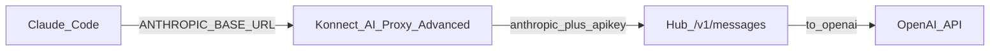
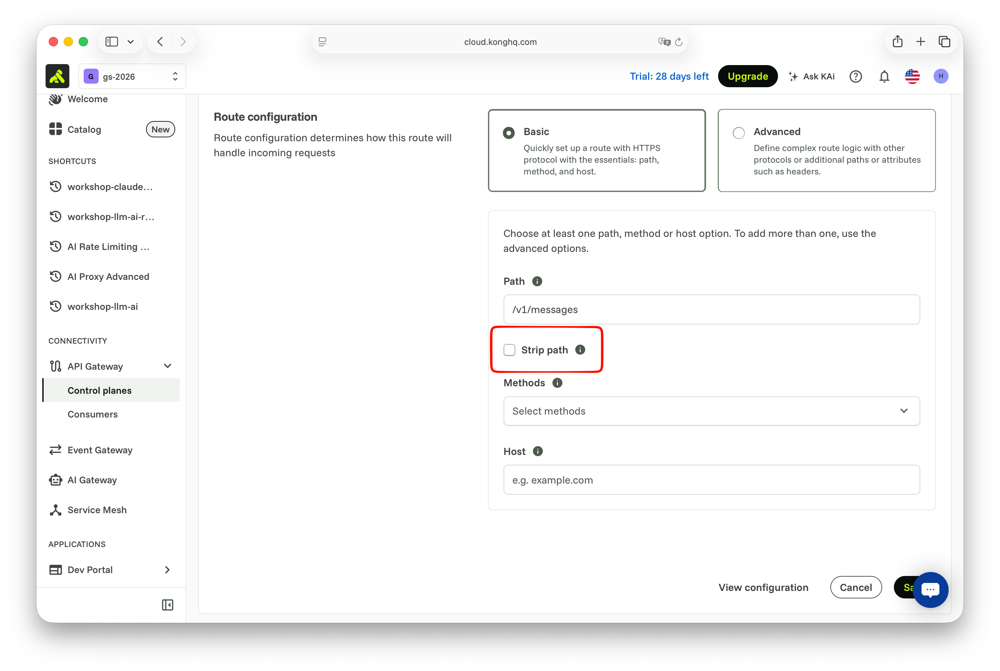
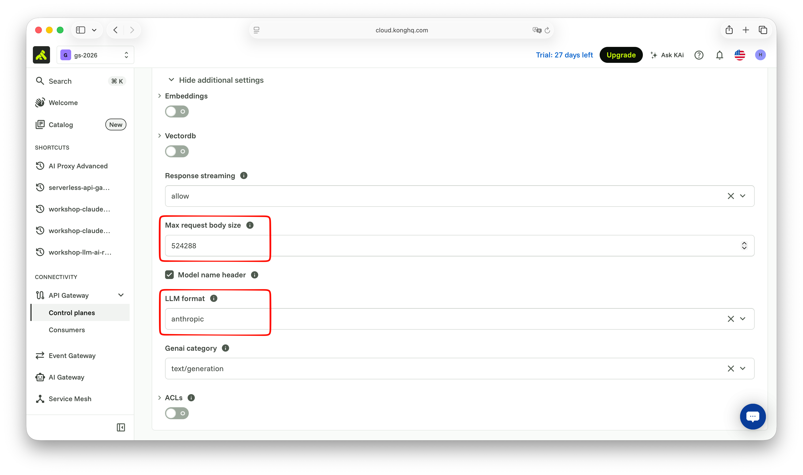
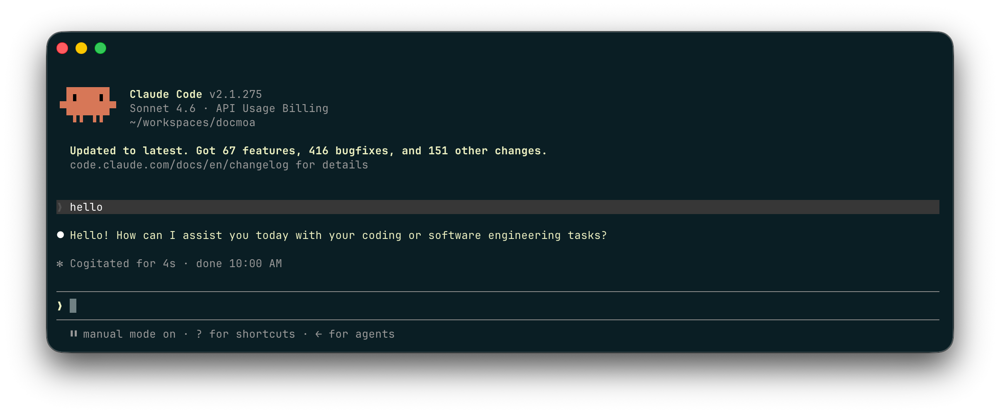

# Scene 6: Claude Code backend

## Purpose

**Claude Code → Konnect (AI Proxy Advanced) → Workshop hub `/v1/messages` → OpenAI**.

- Konnect: forward Anthropic Messages as-is and inject `apikey` (`provider: anthropic` + `llm_format: anthropic`)
- Hub: Anthropic → OpenAI (Terraform `/v1/messages`)


## Request flow




## Lab 0. Verify hub `/v1/messages`

```bash
curl -sS --max-time 60 "$WORKSHOP_LLM_BASE_URL/v1/messages" \
  -H "apikey: $WORKSHOP_LLM_APIKEY" \
  -H "anthropic-version: 2023-06-01" \
  -H "content-type: application/json" \
  -d '{
    "model": "claude-sonnet-4-6",
    "max_tokens": 64,
    "messages": [{"role": "user", "content": "Say hello in one sentence."}]
  }' | jq .
```


## Lab 1. Konnect Service / Route + AI Proxy Advanced

### 1-1. Service / Route

Service URL is the **hub base**. The `127.0.0.1:65535` placeholder breaks upstream on Serverless (`invalid response` / 502).

1. Full URL: `$WORKSHOP_LLM_BASE_URL`  
   Example: `http://<eip>:8000`
2. Route Paths: `/v1/messages`, Strip path **off**
3. `Save`



### 1-2. AI Proxy Advanced

1. Route → `AI Proxy Advanced`
2. Plugin configuration
   - Targets `+`
   - Route type: `llm/v1/chat`
   - Auth
     - Header name: `apikey`
     - Header value: the real `$WORKSHOP_LLM_APIKEY`
     - Allow override: unchecked
   - Model
     - Provider: **`anthropic`** (same format as hub Messages — do not use `openai`)
     - Name: `claude-sonnet-4-6`
   - Options
     - Anthropic version: `2023-06-01`
     - Upstream URL: `$WORKSHOP_LLM_BASE_URL/v1/messages`  
       Example: `http://<eip>:8000/v1/messages`
   - Show additional settings
     - Max request body size: `524288`
     - LLM format: **`anthropic`**
3. `Save`




## Lab 2. Verify with curl via Konnect

```bash
export ANTHROPIC_BASE_URL="$KONNECT_PROXY_URL"

curl -sS --max-time 60 "$ANTHROPIC_BASE_URL/v1/messages" \
  -H "anthropic-version: 2023-06-01" \
  -H "content-type: application/json" \
  -d '{
    "model": "claude-sonnet-4-6",
    "max_tokens": 64,
    "messages": [{"role": "user", "content": "Say hello in one sentence."}]
  }' | jq .
```


## Lab 3. Claude Code

Claude Code defaults to `max_tokens=32000`. Hub OpenAI (`gpt-4o-mini`) caps completion at 16384, so set:

```bash
export ANTHROPIC_BASE_URL="$KONNECT_PROXY_URL"
export ANTHROPIC_AUTH_TOKEN="workshop"
export ANTHROPIC_MODEL="claude-sonnet-4-6"
export CLAUDE_CODE_MAX_OUTPUT_TOKENS=16384
claude
```


