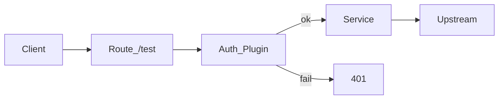
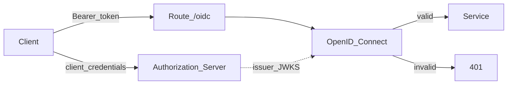

## 목적

Route 접근을 위해 인증요소를 추가합니다.

1. `Consumer` + `key-auth`로 API Key 인증
2. Konnect `Authorization Servers`(Kong Identity)와 `OpenID Connect`로 Bearer 토큰 인증

클라이언트가 upstream 비밀 없이 신원을 증명하는 두 가지 방식을 비교합니다.

## 사전 작업. Request Termination 비활성화

Scene 2 실습 3에서 `/test` Route에 붙인 `Request Termination`이 켜져 있으면, 인증과 무관하게 모든 요청에 대해 항상 `403`이 발생합니다. 먼저 비활성화합니다.

1. Gateway → 본인 Service(예: `my-hello`) → Routes → `/test` Route 선택
2. `Plugins` 탭에서 `Request Termination` 선택
3. 플러그인을 **Disable** 하거나 삭제합니다
4. Proxy URL로 `/test`를 호출해 `403`이 아닌 정상 응답(또는 아직 인증 전이면 200)을 확인합니다





## 실습 1. Consumer 추가 및 key-auth

API Key로 호출자를 Consumer에 매핑합니다. 키 없음/오류는 `401`입니다.


### 1-1. Consumer와 API Key 생성


1. 좌측 메뉴 → `CONNECTIVITY` → `API Gateway` → `Gateways` → 본인 게이트웨이 → `Consumers`
2. Scope: `Control plane`
3.  `+ New consumer` 버튼 클릭
   - Username 예: `student-01`
   - `Save`


생성한 Consumer의 식별 및 인증을 위한 `Credential`을 추가합니다.


1. 생성한 Consumer → `Credentials` → `Key authentication` → `+ New Key Auth credential` 
2. Key에 임의의 값을 입력합니다.
   - `my-auth-key`


### 1-2. Route에 key-auth 플러그인 추가

첫번째 생성한 Route(Header 필요 없음)를 선택하여 진행합니다.


1. `/test` Route → `Plugins` 로 이동합니다.
2. `Request Termination`이 비활성화 되어있거나, 없는지 확인합니다.
3.  `+ New Plugin`를 클릭합니다.
4. `Key Authentication` (`key-auth`) 선택
5. Plugin configuration
   - Key names 예: `apikey` (헤더 이름)
6. `Save`


### 1-3. 호출 확인

```bash
# 401 기대
> curl -sS `https://[MY_PROXY_URL]/test`

{
  "message":"No API key found in request",
  "request_id":"16d49758744b5810785e276aff484b1f"
}

# 200 기대
curl -sS -H "apikey: my-auth-key" `https://[MY_PROXY_URL]/test`
```


## 실습 2. Authorization Server + OpenID Connect

Konnect **Identity**의 Authorization Server로 토큰을 발급하고, Gateway의 `OpenID Connect` 플러그인으로 Bearer 토큰을 검증합니다.

key-auth와 혼선을 피하기 위해 **새 Route** `/oidc`에 OIDC만 적용합니다. (`/test`의 key-auth는 유지)



### 2-1. Authorization Server 생성


1. 좌측 메뉴 → `Identity` → `Authorization servers`
2. `New authorization server` (또는 `+`)
3. General information
   - Name 예: `workshop-auth`
4. Token settings
   - Audience 예: `workshop-httpbin`
5. `Create` 버튼 클릭


### 2-2. Scope와 Client 생성

생성된 서버의 **Issuer URL**는 2-4 에서 사용됩니다.


`Scopes`와 `Client` 에서 다음을 수행합니다.

1. 생성한 Authorization Server에서 Scope를 생성합니다.
   - 해당 Authorization Server 에서 `Scopes` 메뉴 → `+ New scope`
   - Name 예: `workshop``
   - ``Create`
2. 생성한 Authorization Server에서 Client를 생성합니다.
   - 해당 Authorization Server 에서`Clients`메뉴 → `+ New client`
   - Name 예: `workshop-client`
   - Grant types: `client_credentials`
   - 위에서 만든 scope를 허용
   - `Create`


표시되는`client_secret`을 복사합니다 (secret은 한 번만 표시될 수 있습니다)


### 2-3. Route `/oidc` 생성

1. 기존 Service(예: `my-hello`) → Routes → `+ New route`
2. Name 예: `my-hello-oidc-route`
3. Paths: `/oidc`, `Strip path` 활성화
4. `Save`


### 2-4. OpenID Connect 플러그인 추가

Bearer 토큰 검증에는 `issuer`뿐 아니라 JWT의 `aud`와 맞는 `audience`, 그리고 `auth_methods: bearer`가 필요합니다. Client id/secret은 토큰 **발급**용이며, 이미 발급된 Bearer를 검증할 때는 필수가 아닙니다.

1. `/oidc` Route → `Plugins` → `+ New Plugin`
2. `OpenID Connect` 선택
3. Plugin configuration:
   - Common
     - `External auth server` 선택
     - `issuer`에 Authorization Server의 Issuer URL 입력
       (예: `https://<id>.us.identity.konghq.com/auth`)
     - `Client id` / `Client secret`은 비워 두거나, UI에서 필수로 보이면 Client 값을 넣습니다
   - Authorization
     - `Audience required`에 audience인 ``workshop-httpbin` 를 추가합니다.
   - General information
     - Name 예: `oidc_konnect`
4. `Save`


JWT Payload의 `iss`는 `issuer`와, `aud`는 `audience`와 같아야 합니다. 값이 다르면 `401 Unauthorized` / `invalid_token`이 발생합니다.


### 2-5. 토큰 발급 후 호출

`/oidc`에 인증 없이 접근하면 401이 발생합니다.

```
> http `https://[MY_PROXY_URL]/oidc`

HTTP/1.1 401 Unauthorized
...
WWW-Authenticate: Bearer realm="....us.identity.konghq.com", error="invalid_token"

{
    "message": "Unauthorized"
}
```

Access Token을 발급합니다.

```bash
export ISSUER_URL=<authorization-server-issuer>
export CLIENT_ID=<client-id>
export CLIENT_SECRET=<client-secret>

curl -sS -X POST "$ISSUER_URL/oauth/token" \
  -H "Content-Type: application/x-www-form-urlencoded" \
  -d "grant_type=client_credentials" \
  -d "client_id=$CLIENT_ID" \
  -d "client_secret=$CLIENT_SECRET" \
  -d "scope=workshop"
```

출력 예시 :

```json
{
  "access_token": "eyJhbGciOiJSUzI1NiIsImtpZCI6I...",
  "token_type": "Bearer",
  "expires_in": 299,
  "scope": "workshop"
}
```

`https://jwt.io`에서 `access_token`을 decode하여 Payload를 확인해봅니다.

- `iss` ≈ 플러그인 `issuer`
- `aud` ≈ 플러그인 `audience` (`workshop-httpbin`)
- `exp`가 아직 지나지 않았는지


`/oidc`에 `Authorization` Header를 추가하고, Bearer로 호출합니다.

```bash
curl -sS `https://[MY_PROXY_URL]/oidc` \
  -H "Authorization: Bearer $ACCESS_TOKEN"
```

## 추가로 해볼만한 실습

Body의 Authorization을 제거하고 싶다면, `Response Transformer Advanced`를 활용해보세요.

- `/oidc` route에서 `Response Transformer Advanced` 플러그인을 활성화 합니다.
- Remove 대상으로 `JSON`의 `headers.Authorization`을 추가합니다.
- `Additional setting`에서 `Dots in keys`를 비활성화 합니다.
