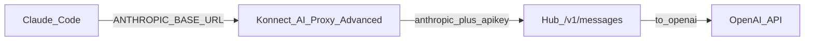

## 목적

**Claude Code → Konnect (AI Proxy Advanced) → Workshop 허브 `/v1/messages` → OpenAI** 경로를 만듭니다.

- Konnect: Anthropic Messages를 **그대로** 허브로 넘기고 `apikey` 주입 (`provider: anthropic` + `llm_format: anthropic`)
- 허브: Anthropic → OpenAI 변환 (Terraform `/v1/messages`)


## 요청 흐름




## 실습 0. 허브 `/v1/messages` 확인

```bash
curl -sS --max-time 60 "$WORKSHOP_LLM_BASE_URL/v1/messages" \
  -H "apikey: $WORKSHOP_LLM_APIKEY" \
  -H "anthropic-version: 2023-06-01" \
  -H "content-type: application/json" \
  -d '{
    "model": "claude-sonnet-4-6",
    "max_tokens": 64,
    "messages": [{"role": "user", "content": "한 문장으로 인사해줘."}]
  }' | jq .
```


## 실습 1. Konnect Service / Route + AI Proxy Advanced

### 1-1. Service / Route

Service URL은 **허브 base**입니다. `127.0.0.1:65535` placeholder는 Serverless에서 upstream 연결이 깨져 `invalid response`(502)가 납니다.

1. Full URL: `$WORKSHOP_LLM_BASE_URL`  
   예: `http://<eip>:8000`
2. Route Paths: `/v1/messages`, `Strip path` **비활성**
3. `Save`


### 1-2. AI Proxy Advanced

1. Route → `AI Proxy Advanced`
2. Plugin configuration
   - Targets `+`
   - Route type: `llm/v1/chat`
   - Auth
     - Header name: `apikey`
     - Header value: **실제** `$WORKSHOP_LLM_APIKEY`
     - Allow override: unchecked
   - Model
     - Provider: **`anthropic`** (허브 Messages와 동일 포맷 — `openai` 금지)
     - Name: `claude-sonnet-4-6`
   - Options
     - Anthropic version: `2023-06-01` 
     - Upstream URL: `$WORKSHOP_LLM_BASE_URL/v1/messages`  
       예: `http://<eip>:8000/v1/messages`
     
   - Show additional settings
     - Max request body size: `524288`
     - LLM format: **`anthropic`**
3. `Save`


## 실습 2. curl로 Konnect 검증

```bash
export ANTHROPIC_BASE_URL="$KONNECT_PROXY_URL"

curl -sS --max-time 60 "$ANTHROPIC_BASE_URL/v1/messages" \
  -H "anthropic-version: 2023-06-01" \
  -H "content-type: application/json" \
  -d '{
    "model": "claude-sonnet-4-6",
    "max_tokens": 64,
    "messages": [{"role": "user", "content": "한 문장으로 인사해줘."}]
  }' | jq .
```


## 실습 3. Claude Code

Claude Code 기본 `max_tokens`는 32000입니다. LLM 허브 OpenAI 모델(`gpt-4o-mini`) 완료 토큰 한도는 16384이라, `CLAUDE_CODE_MAX_OUTPUT_TOKENS`를 설정합니다.

```bash
export ANTHROPIC_BASE_URL="$KONNECT_PROXY_URL"
export ANTHROPIC_AUTH_TOKEN="workshop"
export ANTHROPIC_MODEL="claude-sonnet-4-6"
export CLAUDE_CODE_MAX_OUTPUT_TOKENS=16384
claude
```


