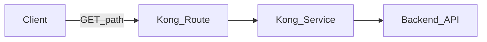
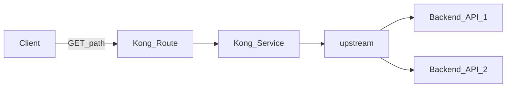

## Purpose

Learn Kong's core routing model: `Service` (upstream) and `Route` (client entry) on your Konnect Serverless gateway.

## Menus used in this lab

Create a Service that points at an upstream and a Route that receives client traffic on your Konnect gateway.

UI path: left menu → `CONNECTIVITY` → `API Gateway` → `Gateways` → your gateway → `Gateway services` / `Routes`.


## Architecture



## Lab 1. Create a Service

1. Open `Gateway services` and click `+ New gateway service`

2. Service endpoint

   - Select `Full URL`

   - Enter `https://httpbin.konghq.com/anything/hello`

3. General information

   - Enter any custom name (e.g. `my-hello`)

4. Click `Save`


## Lab 2. Create a Route

After the Service is saved, the UI opens that Service. The Service exists, but there is no client endpoint yet. Select `Routes` at the top of the page.


1. Open `Routes` and click `+ New route`
2. General information
   - Enter any custom name (e.g. `my-hello-route`)
3. Route configuration

   - Select Basic

   - Paths: `/test`

   - Enable `Strip path`

4. Click `Save`


## Verify the configuration

Call the upstream directly (a private browsing window is recommended).

- `https://httpbin.konghq.com/anything/hello`

```json
{
  "args": {},
  "data": "",
  "files": {},
  "form": {},
  "headers": {
    "Accept": "text/html,application/xhtml+xml,application/xml;q=0.9,*/*;q=0.8",
    "Accept-Encoding": "gzip, deflate, br, zstd",
    "Accept-Language": "ko-KR,ko;q=0.9",
    "Connection": "keep-alive",
    "Host": "httpbin.konghq.com",
    "Priority": "u=0, i",
    "Sec-Fetch-Dest": "document",
    "Sec-Fetch-Mode": "navigate",
    "Sec-Fetch-Site": "none",
    "User-Agent": "Mozilla/5.0 (Macintosh; Intel Mac OS X 10_15_7) AppleWebKit/605.1.15 (KHTML, like Gecko) Version/26.6.2 Safari/605.1.15"
  },
  "json": null,
  "method": "GET",
  "origin": "<client-ip>",
  "url": "http://httpbin.konghq.com/anything/hello"
}
```

Then call through Kong Gateway. You configured:

- `/anything/hello` on `httpbin.konghq.com` as a Service
- a Route with path `/test` to reach that Service

Append `/test` to your Proxy URL and call it.

`https://[MY_PROXY_URL]/test`

```json
{
  "args": {},
  "data": "",
  "files": {},
  "form": {},
  "headers": {
    "Accept": "text/html,application/xhtml+xml,application/xml;q=0.9,*/*;q=0.8",
    "Accept-Encoding": "gzip, deflate, br, zstd",
    "Accept-Language": "ko-KR,ko;q=0.9",
    "Connection": "keep-alive",
    "Host": "httpbin.konghq.com",
    "Priority": "u=0, i",
    "Sec-Fetch-Dest": "document",
    "Sec-Fetch-Mode": "navigate",
    "Sec-Fetch-Site": "none",
    "User-Agent": "Mozilla/5.0 (Macintosh; Intel Mac OS X 10_15_7) AppleWebKit/605.1.15 (KHTML, like Gecko) Version/26.6.2 Safari/605.1.15",
    "X-Forwarded-Host": "<your-proxy-host>",
    "X-Forwarded-Path": "/test",
    "X-Forwarded-Prefix": "/test",
    "X-Kong-Request-Id": "<request-id>"
  },
  "json": null,
  "method": "GET",
  "origin": "<client-ip>",
  "url": "https://<your-proxy-host>/anything/hello"
}
```

The upstream `Host` stays the same. Check which headers Kong added.

## Lab 3. Add an Upstream

`https://httpbin.org` is a mirror of `https://httpbin.konghq.com`. For load balancing, a Service can register multiple Targets on an Upstream.



Setup: register two Targets on an `Upstream`, then change the existing Service host to that Upstream name.


1. Left menu → `CONNECTIVITY` → `API Gateway` → `Gateways` → your gateway → `Upstreams`
2. Click `+ New upstream`
   - Name example: `httpbin-upstream`
   - Algorithm: `Round-robin` (default is fine)
   - `Save`

The Upstream `httpbin-upstream` becomes the connection point instead of the earlier `https://httpbin.konghq.com`.

You can register multiple Targets on an Upstream. Here register `https://httpbin.org` and `https://httpbin.konghq.com`.

1. On the Upstream, open `Targets` → `+ New target`
   - Target: `httpbin.konghq.com:443`, Weight: `100` → `Save`
2. Add another Target on the same Upstream
   - Target: `httpbin.org:443`, Weight: `100` → `Save`
3. Open the Service from Lab 1 under `Gateway services` and edit it
   - Point the endpoint at the Upstream (clear the existing Host `httpbin.konghq.com` and enter `httpbin-upstream`)
   - `Save`


Call the Route path through the Proxy URL several times and check whether response `Host` / `url` alternates between `httpbin.konghq.com` and `httpbin.org`.

- Browsers may cache responses; clear cache and hard-refresh if needed.
- Prefer `curl` or an `http` CLI.

`https://[MY_PROXY_URL]/test`

```bash
> curl -sS `https://[MY_PROXY_URL]/test` | jq -r '.headers.Host'

httpbin.org
httpbin.konghq.com
```
